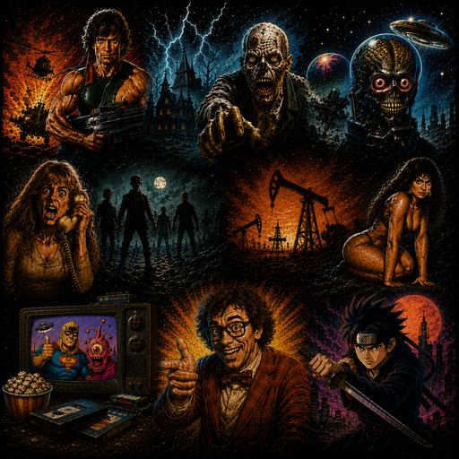
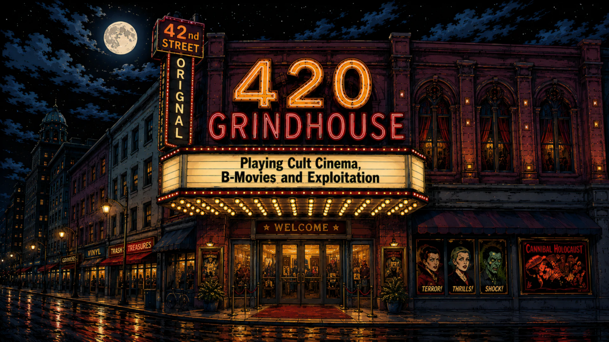
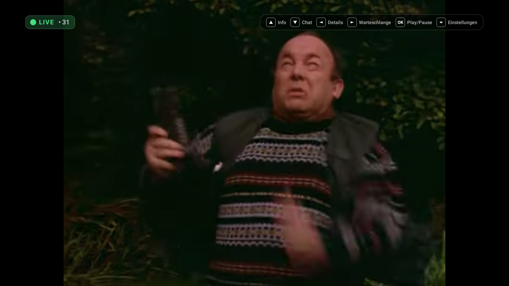
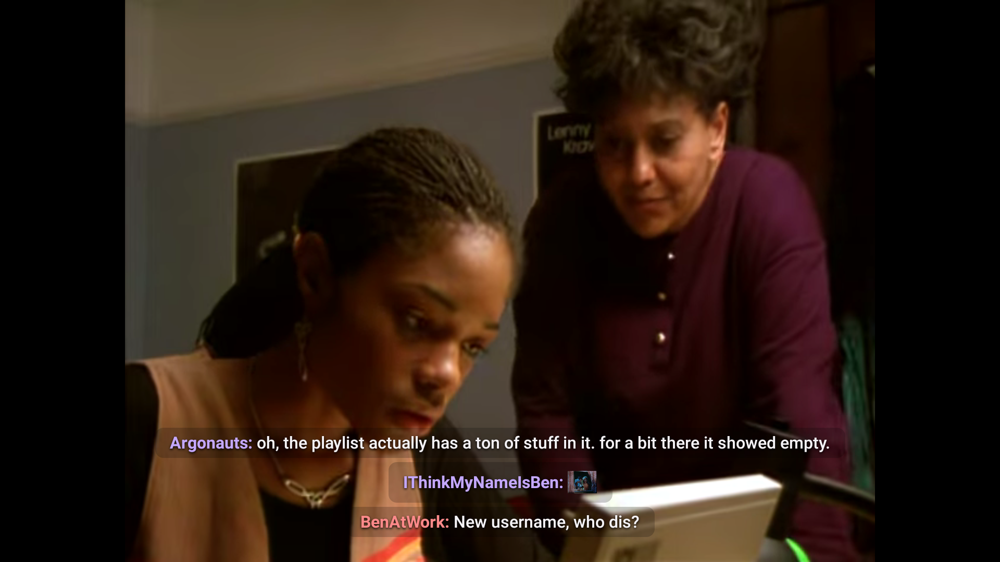
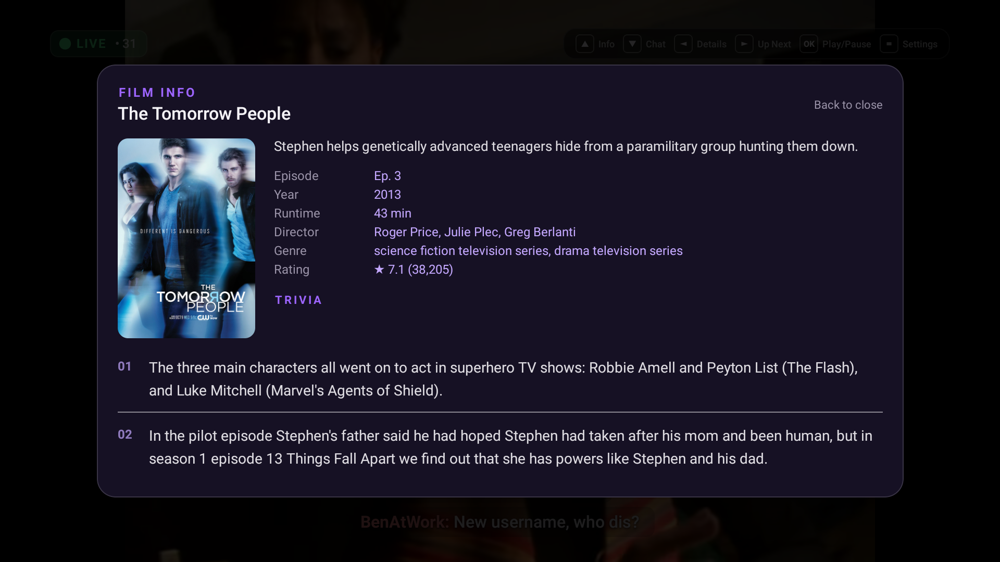
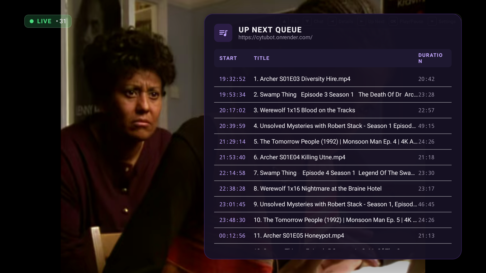

  
  <h1>🍿 Channel Z TV App</h1>
  
<strong>Native Client for the <a href="https://cytu.be/r/Channel-Z">Channel Z CyTube Channel</a></strong>

  
  
  
  

---

  

---

A native client for the **[Channel Z CyTube room](https://cytu.be/r/Channel-Z)** — built for anyone who wants to lean back on the couch and watch movies with a TV remote instead of struggling with web browsers on a Smart TV.

Developed for **Amazon Fire TV, Android TV, Android Smartphones/Tablets, and iOS**.

---

## 🎬 What is this?

The idea was simple: **Watch CyTube on your TV without clunky mouse pointers and tiny web buttons.**

Anyone who has tried controlling a regular website through a TV browser with a remote knows the frustration:
* Tiny controls and hard-to-click buttons
* Sluggish virtual mouse pointers
* Hard-to-read menus
* Frequent resync interruptions

This app brings the experience to life with a true **10-foot TV interface**: launch the app, lean back, use the D-pad, and enjoy the stream in full screen natively.

---

## 🍿 How It Came to Life

Originally, my friend Mike and I built this app as a private weekend project for ourselves and the Grindhouse community.

After sharing it on Reddit, people from the community immediately asked: *"Could you please build this for Channel Z as well?"*

Since we love the channel ourselves and already had a solid native player engine, we got to work: adapted the business logic, EPG scrapers, and sync pipelines for Channel Z, and set up a dedicated clean repository.

No business plan, no startup fluff — just a tool made by fans, for fans.

> *"Not perfect, but rock solid, comfortable, and made with genuine passion."*

---

## 🛋️ The Living Room Setup

Movies are best enjoyed on the big screen, but typing on a TV remote is tedious. That is why the suite separates both worlds:

* **TV App (Light Edition):** Ultra-lightweight, engineered for smooth stutter-free playback, 100% controlled via the D-pad.
* **Mobile App (Full Edition):** Operates as a wireless keyboard in `CHAT_ONLY` mode. Type on your phone, and your messages appear in the live stream on your TV in real-time.

---

## 📺 The Editions

| Edition | Target Devices | Focus | Chat Experience |
| :--- | :--- | :--- | :--- |
| **📺 Android Light** | Fire TV, Android TV, Smart TVs | Lean-back experience, 100% D-pad navigation, minimal RAM footprint | Transparent subtitle overlay over video |
| **📱 Android Full** | Smartphones, Tablets, Handhelds | CyTube account login, full chat composer, user list | Subtitles, sidebar, or fullscreen chat |
| **🍏 iOS** | iPhone, iPad | Swift / SwiftUI build ready for sideloading | Chat overlay & playlist queue |

---

## 📸 Screenshots

| Player HUD & Live Stream | Chat as TV Subtitles |
| :---: | :---: |
|  |  |

| Movie Details & Trivia | Schedule & Queue |
| :---: | :---: |
|  |  |

---

## 🚀 Technical Highlights

* **⚡ Seamless Stutter-Free Synchronization:**  
  Native sync handling with lead-time buffering and adaptive tempo correction (1.04x / 0.96x via the Sonic audio processor). Minor network drift is smoothed out imperceptibly without triggering buffering pauses.
* **🎥 Hybrid Video Engine:**  
  Direct streams (HLS `.m3u8`, MP4, Google Drive, etc.) run through **AndroidX Media3 ExoPlayer** with full hardware decoding. External feeds (YouTube, Vimeo) run through a hardware-accelerated WebView bridge with an automated player watchdog.
* **💬 Chat as TV Subtitles:**  
  CyTube chat messages glide in smoothly at the bottom of the screen. Font size, background opacity, and max lines are customizable on the fly.
* **🎬 Smart Movie Info & Trivia (Zero API Keys):**  
  Strips scene tags (`1080p`, `BluRay`, `x264`) from the video title and loads posters, directors, release years, and trivia facts automatically.
* **📅 Multi-Tier Schedule:**  
  Reads the current playlist queue directly via WebSocket with automatic fallback parsers.
* **🎨 OLED-Tuned Themes:**  
  Four dark color profiles optimized for contrast and deep blacks on OLED displays.
* **🔄 In-App Updater:**  
  Automatically checks for new GitHub releases on launch and updates directly on-device.

---

## 🎮 Remote Control Mapping

| Remote Button | Action |
| :--- | :--- |
| **D-Pad UP** | Toggle Now-Playing HUD (Title, Poster, Runtime, Progress) |
| **D-Pad DOWN** | Toggle Chat Subtitles on / off |
| **D-Pad LEFT** | Open Movie Details & Trivia facts |
| **D-Pad RIGHT** | Open Playlist & Queue schedule |
| **D-Pad CENTER (OK)** | Play / Pause |
| **MENU / OPTIONS** | Open Settings menu |
| **BACK** | Close active overlay / Exit app |

---

## 📥 Download & Installation

Pre-built binaries are available directly under [Releases](https://github.com/kburna243/channel-z-app/releases/latest).

### 📺 Fire TV & Android TV (via Downloader App)
1. Install the **Downloader** app on your TV from the Amazon Appstore / Google Play Store.
2. In your TV settings under Developer Options, set permission for *Install unknown apps* to **ON** for the Downloader app.
3. Open Downloader and enter the direct URL:  
   `https://github.com/kburna243/channel-z-app/releases/latest/download/channel-z-light.apk`
4. Install, open, and start streaming right away!

### 📱 Android (Smartphones & Tablets)
1. Download **[channel-z-full.apk](https://github.com/kburna243/channel-z-app/releases/latest/download/channel-z-full.apk)**.
2. Open the file and follow the install prompt.

### 🍏 iOS (iPhone & iPad)
1. Download **[channel-z.ipa](https://github.com/kburna243/channel-z-app/releases/latest/download/channel-z.ipa)**.
2. Install via **AltStore**, **Sideloadly**, or **TrollStore**.

---

## 👥 Authors & Co-Creators

* **Fried ([@kburna243](https://github.com/kburna243))** – Core Development, Architecture & Android Engineering
* **Mike** – Co-Creator, Concept & Testing

---

## 🤝 Credits & Acknowledgements

* **[calzoneman/sync](https://github.com/calzoneman/sync):** Thank you for the CyTube foundation and WebSocket protocol.
* **[SPUDZARENEAT](https://github.com/spudzareneat):** For the lead-time sync inspiration from grindhouse-tv.
* Thank you to the **Channel Z Community** on Reddit for the continuous feedback and ideas!

---

## 🐛 Feedback & Bug Reports

Found an issue or have a feature suggestion?
* Directly in the app: **Settings ➔ Report a Problem**
* Via GitHub: [Open an Issue](https://github.com/kburna243/channel-z-app/issues)

---

## ⚖️ Disclaimer

*Unofficial community project. Not affiliated with or endorsed by CyTube or Channel Z. All trademarks, media content, and streams belong to their respective owners.*
