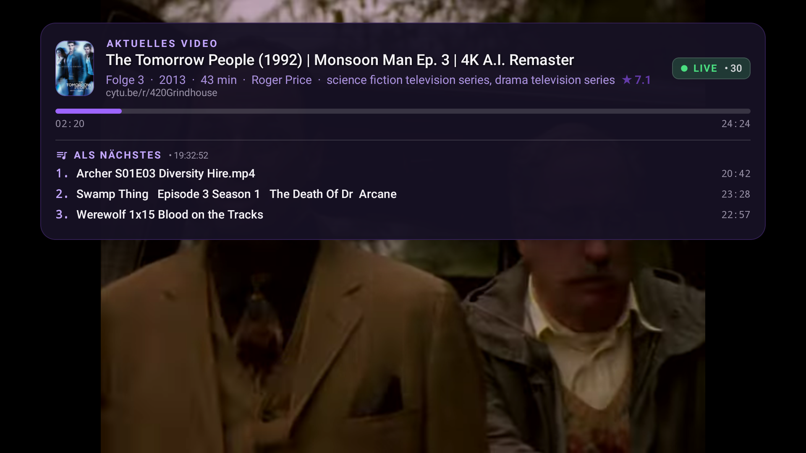
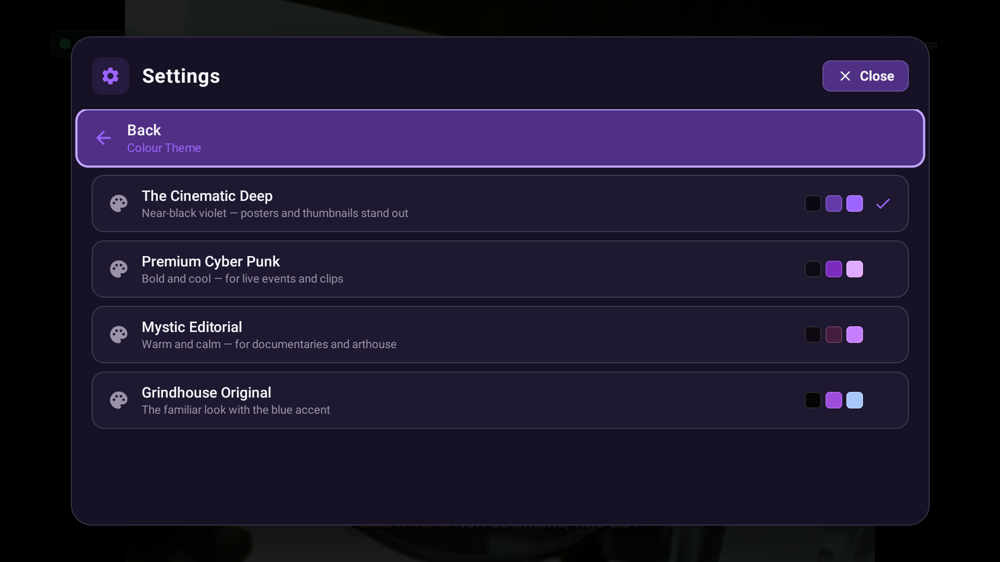
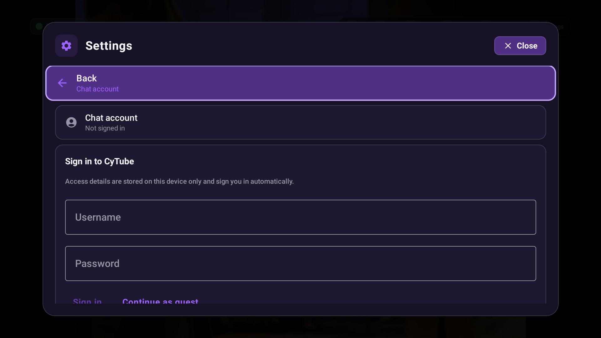
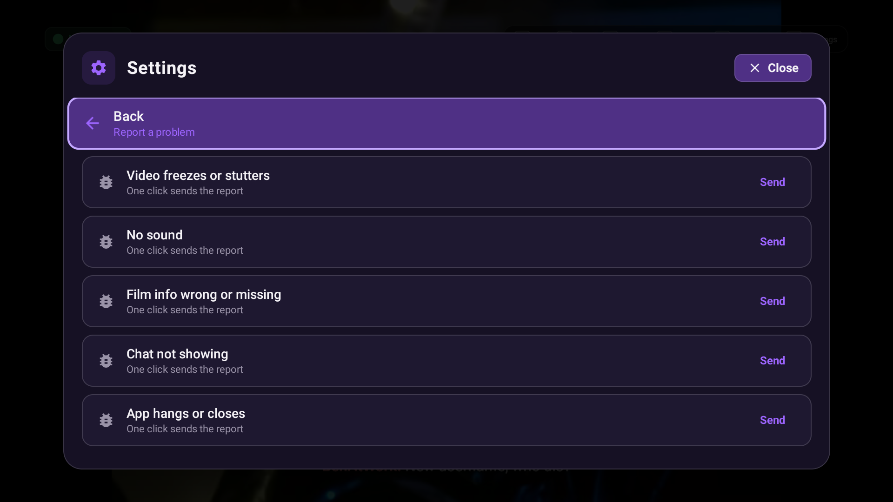

# 🍿 Mikes 420 Grindhouse App

An unofficial, native client suite for the [420Grindhouse CyTube channel](https://cytu.be/r/420Grindhouse) — engineered from the ground up for **Amazon Fire TV, Android TV, Smartphones, Tablets, and iOS**.

---

  

---

## 📖 The Story & Genesis

A good friend of mine (**Bernd**) and I (**Fried**) built this native app to watch the 420 Grindhouse channel together. 

Our goal was simple: **create an easy-to-use, native 10-foot TV interface that feels amazing on the big screen**, completely eliminating the need for clunky web browsers or awkward mouse-pointer navigation on Fire TV / Android TV.

Originally, this was purely a private hobby project for our own living room. We never planned a public release. However, after showing early builds to the channel operators, they were so supportive and encouraging that they explicitly asked us to share it with the wider community! That gave us the final push to polish the app, build an automated update feed, and make it available for everyone.

> *"The app is not perfect — and probably never will be. But we had a blast building it, and we hope you have just as much fun using it."*

---

## 🤝 Community Shoutouts & Related Projects

We believe in giving credit where credit is due:

* 🌟 **Special Shoutout to [SPUDZARENEAT](https://github.com/spudzareneat):**  
  After working on our native app for several weeks, we discovered that **SPUDZARENEAT** had independently built a great web-based TV companion:  
  👉 **[grindhouse-tv on GitHub](https://github.com/spudzareneat/grindhouse-tv)**  
  Since our native Kotlin/Swift apps were already nearly complete, we didn't start over, but we took his project as great inspiration and incorporated some of his ideas. Check out his project!
* ⚙️ **The CyTube Platform & Sync Protocol:**  
  Built upon the WebSocket protocol and client-sync concepts established by [calzoneman/sync](https://github.com/calzoneman/sync).

---

## 🛋️ The Ecosystem: 3 Specialized App Editions

Watching on a big screen with a remote and chatting on a phone keyboard are fundamentally different experiences. That is why this project provides **three distinct variants**:

| Edition | Target Devices | Highlights | Chat Mode |
| :--- | :--- | :--- | :--- |
| **📺 Android Light** | Amazon Fire TV, Android TV, Smart TV | Borderless full-screen streaming, 100% D-Pad remote navigation, zero bloat | Subtitle-style overlay over video |
| **📱 Android Full** | Smartphones, Tablets, Handhelds (Steam Deck) | Full companion app: CyTube login, chat composer, spellcheck, userlist | Subtitles, Sidebar, or Fullscreen Chat-Only |
| **🍏 iOS (IPA)** | iPhone, iPad | Native Swift / SwiftUI port for sideloading (AltStore / Sideloadly) | Subtitle chat overlay & EPG |

### 💡 The Ultimate Living Room Setup
Run the **Light Edition** on your TV for the big-screen movie. Place your phone on the couch running the **Full Edition** in `CHAT_ONLY` mode. Your phone acts as a silent wireless keyboard — you type on your phone, and your messages appear on the TV screen in real-time!

---

## 🚀 Key Features

* **⚡ Hybrid Video Engine:**  
  Automatically selects the best playback pipeline: native **AndroidX Media3 ExoPlayer** for direct streams (HLS `.m3u8`, DASH, MP4, on-the-fly Google Drive resolution) and an optimized, hardware-accelerated **WebView bridge** for YouTube, Twitch, and Vimeo. Includes automatic **AV1 hardware decoder detection** to avoid software-decoding stutter.
* **💬 CyTube Chat as Subtitles:**  
  Chat messages appear unobtrusively like movie subtitles at the bottom of the screen. Fully customizable: opacity, font size, line count, and color themes (Grindhouse vs. Classic CyTube).
* **🎬 Automatic Movie Metadata & Trivia (Zero API Keys):**  
  Live title parsing strips scene tags (`1080p`, `x264`, series formats like `S01E10`) and queries Wikidata & IMDb for high-res posters, director, release year, IMDb ratings, and up to 25 trivia facts in a fullscreen panel.
* **📅 Multi-Tier EPG & Schedule Scraping:**  
  Live schedule pulled via CyTube WebSocket, with fallback to the channel Schedule-Bot and Reddit EPG broadcast.
* **🎨 OLED-Tuned Themes:**  
  4 handcrafted palettes: *The Cinematic Deep* (OLED black/purple), *Premium Cyber Punk*, *Mystic Editorial*, and *Grindhouse Original*.
* **🔄 Seamless In-App Updates:**  
  Checks the official GitHub release feed at launch and updates in-place without losing settings.
* **🐛 1-Click Bug Reporter:**  
  Send diagnostic reports directly from the settings menu (auto-attaches device model, Android version, and current movie title).

---

## 📸 Screenshots

  <table>
    <tr>
      <td width="50%"> <em>1. Borderless Cinema Player</em></td>
      <td width="50%"> <em>2. Now-Playing HUD & Metadata</em></td>
    </tr>
    <tr>
      <td width="50%"> <em>3. Chat rendered as TV Subtitles</em></td>
      <td width="50%"> <em>4. Fullscreen Movie Details & Trivia</em></td>
    </tr>
    <tr>
      <td width="50%"> <em>5. Schedule & Up-Next Queue</em></td>
      <td width="50%"> <em>6. 4 OLED-Tuned Color Themes</em></td>
    </tr>
    <tr>
      <td width="50%"> <em>7. Chat Account & Guest Login</em></td>
      <td width="50%"> <em>8. Built-in 1-Click Bug Reporter</em></td>
    </tr>
  </table>

---

## 🎮 TV Remote Controls (D-Pad)

Control everything comfortably from your couch:

| Button | Action |
| :--- | :--- |
| **D-Pad UP** | Show Now-Playing HUD (Title, Poster, Year, Director, Progress) for 5s |
| **D-Pad DOWN** | Toggle Subtitle-Chat overlay on / off |
| **D-Pad LEFT** | Open Movie Details & Trivia panel |
| **D-Pad RIGHT** | Open Schedule & Queue sidebar |
| **D-Pad CENTER (OK)** | Play / Pause video |
| **MENU / OPTIONS** | Open Main Settings |
| **BACK** | Close open overlays or show Exit confirmation |

---

## 📥 Download & Installation

### Option 1: Fire TV / Android TV (Via Downloader App)
1. Install the **Downloader** app from the Amazon Appstore or Google Play Store.
2. In Fire TV Settings: Go to `My Fire TV` > `Developer Options` > `Install Unknown Apps` > Enable **Downloader**.
3. Open Downloader and enter the direct APK link from our [Latest Releases](https://github.com/kburna243/mikes-420grindhouse-app/releases/latest):
   - **Light APK (TV):** `mikes-grindhouse-light.apk`
4. Click **Install**. (No manual server config needed — connects to 420Grindhouse on first launch!)

### Option 2: Android Smartphones & Tablets
1. Download `mikes-grindhouse-full.apk` from [Latest Releases](https://github.com/kburna243/mikes-420grindhouse-app/releases/latest).
2. Tap the downloaded file to install.

### Option 3: iOS (iPhone / iPad Sideloading)
1. Download `mikes-grindhouse.ipa` from [Latest Releases](https://github.com/kburna243/mikes-420grindhouse-app/releases/latest).
2. Install using **AltStore**, **Sideloadly**, or **TrollStore**.

---

## 🐛 Bug Reporting & Feedback

Encountered an issue or have an idea for an enhancement?
* 🚀 **In-App:** Open **Settings > Problem melden** directly inside the app.
* 💻 **GitHub Issues:** Open an issue via our [GitHub Issue Templates](https://github.com/kburna243/mikes-420grindhouse-app/issues/new/choose) (forms available for Android Light, Android Full, and iOS).

---

## ⚖️ Disclaimer

*This is an unofficial, non-commercial community project. It is not affiliated with or endorsed by CyTube or the 420Grindhouse channel administrators.*
