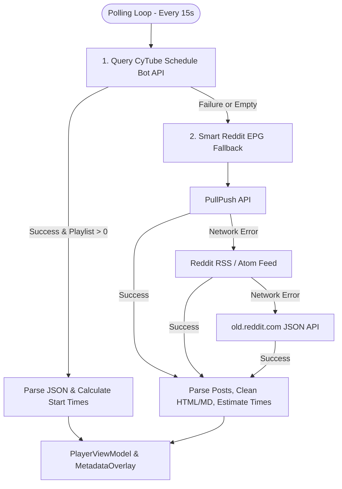

# 📅 EPG & Schedule Scraper Architecture

This document provides a technical walkthrough of how the **Electronic Program Guide (EPG)** and playlist schedule scraping works across the CyTube client engine, detailing the polling cycle, multi-tier endpoints, parsing heuristics, and fallback mechanisms.

---

## 🏗️ 1. High-Level Architecture & Data Flow

The schedule architecture is structured across three layers:
1. **`DataScraper.kt`:** A background polling service running on Kotlin Coroutines (`Dispatchers.IO`).
2. **`PlayerViewModel.kt`:** The state aggregator that merges live room WebSockets with scraped schedules.
3. **`MetadataOverlay.kt`:** The 10-foot TV Compose UI layer displaying *Now Playing* and *Up Next* lineups.

---

## ⚡ 2. Polling Cycle & Reactive State

* **Polling Execution:** `DataScraper.startScraping(pollIntervalMillis = 15000L)` launches a coroutine job on `Dispatchers.IO`. Every 15 seconds, it queries the active endpoints while `isActive` is true.
* **Exposed StateFlows:**
  * `scheduleItems: StateFlow<List<MediaItem>>`
  * `queueScheduleItems: StateFlow<List<QueueScheduleItem>>`
  * `redditScheduleTitle: StateFlow<String?>`
  * `redditScheduleText: StateFlow<String?>`
  * `isRedditFallback: StateFlow<Boolean>`

---

## 📡 3. Primary Data Source: CyTube Schedule Bot (`fetchScheduleFromCytubot`)

Whenever a CyTube room operates an external schedule bot (loaded via `channelOpts.externaljs`), the scraper connects directly to the bot's JSON endpoint:

* **Endpoint Priority:**
  1. `https://bot.420grindhouseserver.com/schedule` *(Self-hosted primary bot instance)*
  2. `https://cytubot.onrender.com/schedule` *(Backup cloud instance)*
* **JSON Payload Parsing:**
  * Extracts the root `playlist` array and `remainingSeconds` of the active media item.
  * Calculates cumulative estimated start times:
    $$\text{estStartTimeMs} = \text{nowMs} + (\text{accumulatedSeconds} \times 1000)$$
  * Formats timestamps to `HH:mm:ss` (e.g., `21:45:00`) and converts durations to human-readable formats (e.g., `1:32:15`).
  * Maps each entry into [`MediaItem`](file:///I:/channel-z-app/android/app/src/main/java/com/example/data/model/CyTubeModels.kt) and [`QueueScheduleItem`](file:///I:/channel-z-app/android/app/src/main/java/com/example/data/model/CyTubeModels.kt).

---

## 🛡️ 4. Secondary Source: Smart Reddit EPG Fallback (`fetchScheduleFromReddit`)

If the schedule bot is offline or returns an empty queue, the engine automatically falls back to scraping subreddit broadcast posts:

* **Fallback Endpoints:**
  1. `https://api.pullpush.io/reddit/search/submission/?subreddit=<subname>&size=15`
  2. `https://www.reddit.com/r/ <subname>/.rss`
  3. `https://old.reddit.com/r/<subname>/new.json?limit=15`

### Sanitization & Detection Heuristics
* **Post Identification:** Detects marathon and daily lineup posts using keyword matching:
  `schedule`, `programm`, `lineup`, `weekend`, `marathon`.
* **Noise Filter:** Rejects user chat and community inquiries (e.g., questions ending with `?`, containing `down?`, or `anyone know...`).
* **HTML & Markdown Cleaner:**
  * **2-Pass HTML Entity Decoding:** Handles nested Reddit entity encodings (`&amp;#32;`, `&lt;`, `&gt;`, `&quot;`, `&apos;`, `&nbsp;`).
  * **Tag & Metadata Stripping:** Eliminates comments `<!-- -->`, raw tags `<...>`, Reddit footers (`submitted by...`, `[link]`, `[comments]`), and system tags (`SC_OFF`, `SC_ON`).
  * **Markdown Formatting:** Cleans bold/italic markers (`**`, `*`), inline markdown links `[text](url)`, and headers `#`.
* **Time Estimation:** In fallback mode without exact cue points, feature films are estimated at **90 minutes (5400s)** per movie to project rolling start times.

---

## 📺 5. UI Integration & Priority Hierarchy

In [`PlayerViewModel.kt`](file:///I:/channel-z-app/android/app/src/main/java/com/example/player/PlayerViewModel.kt):
1. **Priority Resolution:**
   * **Tier 1 (Highest):** Real-time CyTube WebSocket queue (`socketClient.nowPlaying` & `socketClient.playlist`).
   * **Tier 2:** Scraped bot schedule (`DataScraper.queueScheduleItems`).
   * **Tier 3 (Lowest):** Reddit fallback projections (`isRedditFallback = true`).
2. **Metadata Overlay Display:**
   * [`MetadataOverlay.kt`](file:///I:/channel-z-app/android/app/src/main/java/com/example/ui/metadata/MetadataOverlay.kt) renders the active video poster/details alongside the next 3 scheduled items with start times and durations.
   * If running on Reddit fallback data, a distinct visual indicator (`epg_up_next_reddit`) is displayed.
