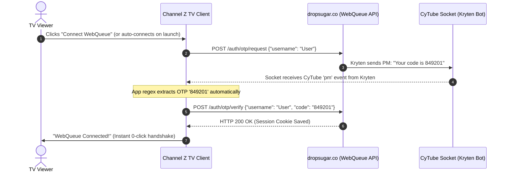

# 📑 Feature Proposal: Automated WebQueue Authentication & EPG Integration

**Target:** `Channel-Z Android / Fire TV App`  
**Estimated Effort:** **2 – 4 hours** (Low complexity)  
**Status:** Proposal / Ready for Implementation  
**Direct Links:**
* [WebQueue Login Page](https://queue.dropsugar.co/auth/login)
* [WebQueue Active Queue](https://queue.dropsugar.co/queue)
* [Interactive Swagger API Documentation](https://queue.dropsugar.co/docs)
* [ReDoc API Documentation](https://queue.dropsugar.co/redoc)
* [OpenAPI JSON Schema](https://queue.dropsugar.co/openapi.json)
* [Upstream Repository (`grobertson/kryten-webqueue`)](https://github.com/grobertson/kryten-webqueue)

---

## 🎯 1. Executive Summary

Channel Z operates an official queue and catalog management platform running **`kryten-webqueue v0.40.4`** at [`https://queue.dropsugar.co`](https://queue.dropsugar.co).

Currently, all queue and schedule endpoints require user authentication. Integrating this authentication flow into the TV client will unlock **exact playlist queues**, **scheduled movie marathons**, and **full catalog browsing** without requiring third-party web scrapers.

---

## 🔄 2. How the Authentication Works

The authentication mechanism relies on a 2-step One-Time Password (OTP) handshake mediated by the channel's bot (**Kryten**) over CyTube:

1. **Request OTP:**
   * `POST https://queue.dropsugar.co/auth/otp/request`
   * Body: `{"username": "<CyTube-Username>"}`
   * *Action:* The bot `Kryten` sends a private message (PM) containing a 6-digit verification code to the user in the Channel-Z CyTube chat.
2. **Verify OTP & Receive Session:**
   * `POST https://queue.dropsugar.co/auth/otp/verify`
   * Body: `{"username": "<CyTube-Username>", "code": "123456"}`
   * *Action:* Returns `HTTP 200 OK` and sets an authenticated `session_id` cookie.

---

## ✨ 3. The "Zero-Click / Magic Login" Innovation

Because our TV app already maintains a live WebSocket connection to CyTube via [`CyTubeSocketClient.kt`](../android/app/src/main/java/com/example/data/socket/CyTubeSocketClient.kt), we can automate the entire OTP process **without requiring manual code entry on a TV remote**:

---

## 🛠️ 4. Implementation Breakdown

| Component | Responsibility | Effort |
| :--- | :--- | :--- |
| **`WebQueueApiClient.kt`** | OkHttp client with persistent `CookieJar` handling `/auth/otp/*`, `/queue/state`, and `/queue/next-schedule`. | ~ 45 min |
| **PM Listener** | Extend `CyTubeSocketClient` to capture incoming PMs from `Kryten` and emit the extracted OTP via a Kotlin `SharedFlow`. | ~ 20 min |
| **Session Persistence** | Store the authenticated session cookie in `SettingsRepository` for silent reconnection across app restarts. | ~ 30 min |
| **UI Integration** | Add a "WebQueue Link" action in the settings / account dialog with fallback manual 6-digit input if needed. | ~ 45 min |
| **EPG Feed Wiring** | Map `GET /queue/state` and `GET /queue/next-schedule` directly into `MetadataOverlay.kt`. | ~ 30 min |

---

## 🎁 5. Unlocked Capabilities & Features

Once authenticated, the app can consume official endpoints directly:

* 📋 **`GET /queue/state`:** Real-time queue order, exact video runtimes, media types, and the usernames who queued each item.
* 📅 **`GET /queue/next-schedule`:** Scheduled blocks, themed marathons, and upcoming auto-queued playlists.
* 📚 **`GET /catalog/browse` & `/catalog/search`:** Search the entire Channel-Z film catalog directly from the TV app.
* 🕒 **`GET /queue/history`:** Recently played media history.
